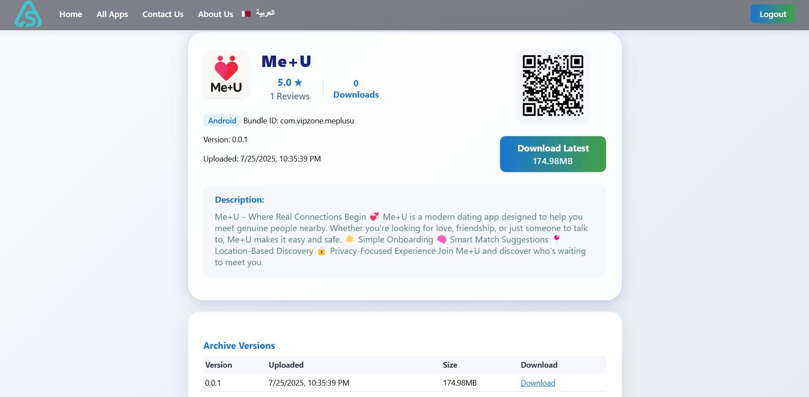
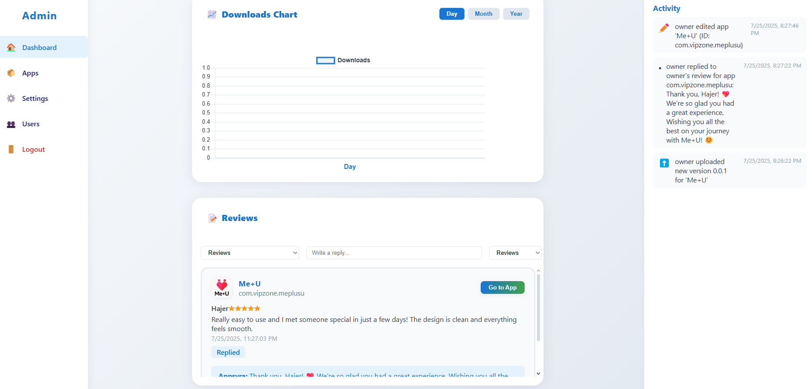
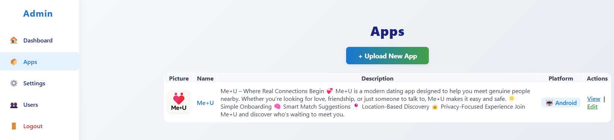
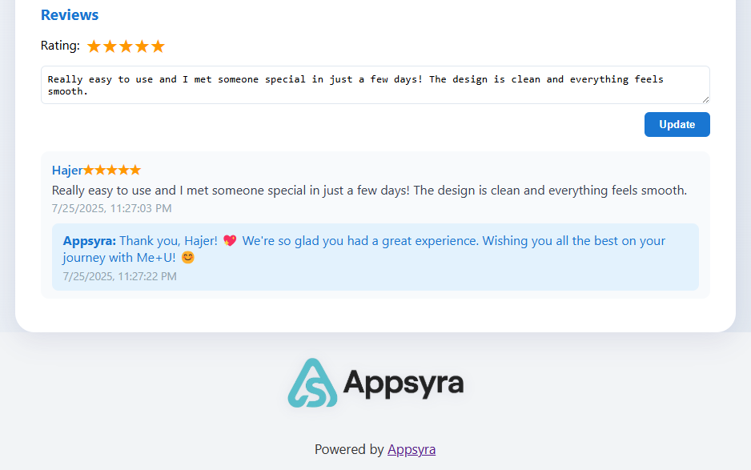

<p align="center">
  
</p>

# Appsyra

A modern, self-hosted app distribution and management platform for iOS and Android.

---

**Open Source Notice**

This project was created by Dhia Bechattaoui for Innova Wide and released as open source for the community.

Inspired by [significa/app-distribution-server](https://github.com/significa/app-distribution-server).

---

## Features
- Upload and manage iOS/Android app builds
- Admin dashboard (login required)
- Version archive and app info pages
- i18n (Arabic/English, RTL/LTR)
- Modern UI with gradient backgrounds
- Persistent storage via Docker volumes
- QR code for easy app download

## Quick Start (Docker)

1. **Build the Docker image:**
   ```sh
   docker compose build
   ```
2. **Run with Docker Compose:**
   ```sh
   docker compose up
   ```
3. **Visit the app:**
   - [http://localhost:8000](http://localhost:8000)

## Default Secret Key
- The default upload secret is: `UPLOADS_SECRET_AUTH_TOKEN=devtoken`
- Set your own secret in production via environment variable:
  ```sh
  export UPLOADS_SECRET_AUTH_TOKEN=your-strong-secret
  ```

## Environment Variables
- `UPLOADS_SECRET_AUTH_TOKEN` – Secret token for API uploads (default: `devtoken`)
- `LOGO_URL` – Path or URL to logo (default: `/static/logo.png`)
- `APP_TITLE` – App title (default: `Appsyra`)

## Volumes
- App static files and uploads are persisted using Docker volumes:
  - `app_static` → `/app/static`
  - `app_uploads` → `/app/uploads`

## Security Notes
- **Change the default admin password and secret key before production.**
- Expose only necessary ports.

## License
MIT 

## First-Time Setup: Creating an Owner/Admin User

If no users exist, you must manually create the first owner/admin user to access the admin dashboard:

1. On first run, a default owner user is created automatically if no users exist:
   - **Username:** `owner`
   - **Password:** `owner123`
   - **Role:** `owner`
   > **Change these in production!**
2. Save the file and restart the server.
3. Log in at `/login` with your chosen credentials.

**Note:** Passwords are stored in plain text by default. For production, implement password hashing and secure user management. 

## App Screenshots

<p align="center">
  
</p>

<p align="center">
  
</p>

<p align="center">
  
</p>

<p align="center">
  
</p>

## Community Standards
See our [Code of Conduct](CODE_OF_CONDUCT.md) and [Contributing Guidelines](CONTRIBUTING.md) to help keep this project welcoming and collaborative.

## How to Contribute
We welcome contributions! Please read [CONTRIBUTING.md](CONTRIBUTING.md) for guidelines before submitting a pull request. 